# [📈 Live Status](https://up.pixelpirat.ch): <!--live status--> **🟧 Partial outage**

This repository contains the open-source uptime monitor and status page for [kkehrer projects](https://up.pixelpirat.ch), powered by [Upptime](https://github.com/upptime/upptime).

<!--start: status pages-->
<!-- This summary is generated by Upptime (https://github.com/upptime/upptime) -->
<!-- Do not edit this manually, your changes will be overwritten -->
<!-- prettier-ignore -->
| URL | Status | History | Response Time | Uptime |
| --- | ------ | ------- | ------------- | ------ |
|  [Bartsch-Consulting](https://www.bartsch-consulting.ch) | 🟩 Up | [bartsch-consulting.yml](https://github.com/kkehrer/upptime/commits/HEAD/history/bartsch-consulting.yml) | 

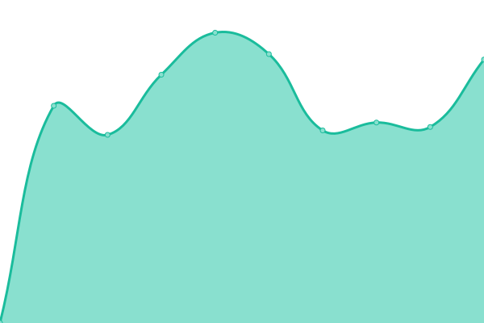 2065ms
     
 | 

<a href="https://up.pixelpirat.ch/history/bartsch-consulting">100.00%</a>
    

|  [Bitowl](https://bitowl.ch) | 🟥 Down | [bitowl.yml](https://github.com/kkehrer/upptime/commits/HEAD/history/bitowl.yml) | 

 291ms
     
 | 

<a href="https://up.pixelpirat.ch/history/bitowl">0.09%</a>
    

|  [Cavedelorge](https://cavedelorge.ch) | 🟩 Up | [cavedelorge.yml](https://github.com/kkehrer/upptime/commits/HEAD/history/cavedelorge.yml) | 

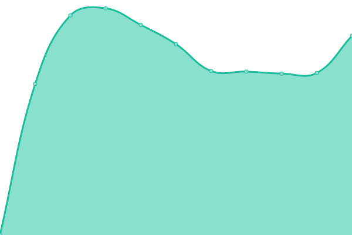 2601ms
     
 | 

<a href="https://up.pixelpirat.ch/history/cavedelorge">100.00%</a>
    

|  [Goldhahn](https://goldhahn.swiss) | 🟩 Up | [goldhahn.yml](https://github.com/kkehrer/upptime/commits/HEAD/history/goldhahn.yml) | 

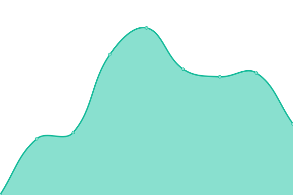 6605ms
     
 | 

<a href="https://up.pixelpirat.ch/history/goldhahn">100.00%</a>
    

|  [Ine.rave](https://www.ine-rave.com) | 🟩 Up | [ine-rave.yml](https://github.com/kkehrer/upptime/commits/HEAD/history/ine-rave.yml) | 

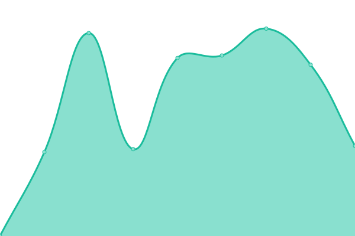 1377ms
     
 | 

<a href="https://up.pixelpirat.ch/history/ine-rave">100.00%</a>
    

|  [Keey](https://keey.ch) | 🟩 Up | [keey.yml](https://github.com/kkehrer/upptime/commits/HEAD/history/keey.yml) | 

 2635ms
     
 | 

<a href="https://up.pixelpirat.ch/history/keey">100.00%</a>
    

|  [PixelPirat](https://pixelpirat.ch) | 🟩 Up | [pixel-pirat.yml](https://github.com/kkehrer/upptime/commits/HEAD/history/pixel-pirat.yml) | 

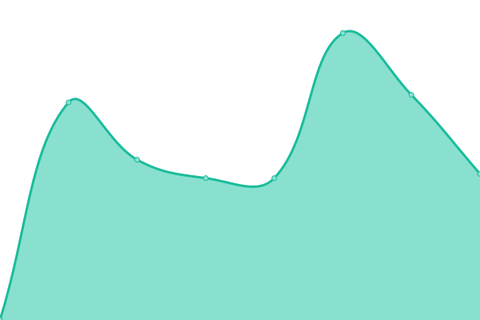 2336ms
     
 | 

<a href="https://up.pixelpirat.ch/history/pixel-pirat">100.00%</a>
    

|  [Sakartwelo](https://www.sakartwelo.com) | 🟩 Up | [sakartwelo.yml](https://github.com/kkehrer/upptime/commits/HEAD/history/sakartwelo.yml) | 

 1790ms
     
 | 

<a href="https://up.pixelpirat.ch/history/sakartwelo">100.00%</a>
    

|  [Seilers-Werbeblog](https://www.seilers-werbeblog.ch) | 🟩 Up | [seilers-werbeblog.yml](https://github.com/kkehrer/upptime/commits/HEAD/history/seilers-werbeblog.yml) | 

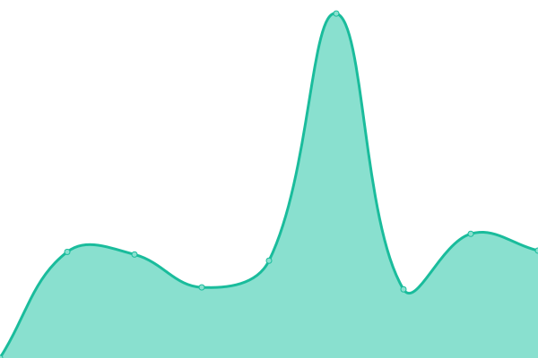 1754ms
     
 | 

<a href="https://up.pixelpirat.ch/history/seilers-werbeblog">100.00%</a>
    

|  [StudioPM](https://studiopm.ch) | 🟩 Up | [studio-pm.yml](https://github.com/kkehrer/upptime/commits/HEAD/history/studio-pm.yml) | 

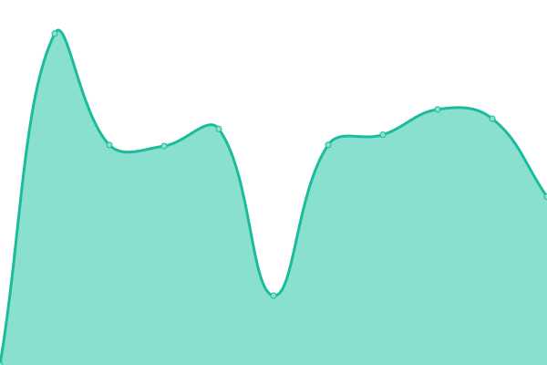 3076ms
     
 | 

<a href="https://up.pixelpirat.ch/history/studio-pm">100.00%</a>
    

|  [TanDem](https://tan-dem.co) | 🟩 Up | [tan-dem.yml](https://github.com/kkehrer/upptime/commits/HEAD/history/tan-dem.yml) | 

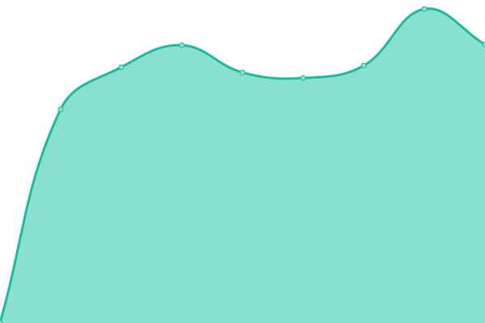 1947ms
     
 | 

<a href="https://up.pixelpirat.ch/history/tan-dem">100.00%</a>
    

|  [Wellenreiter](https://www.wellenreiter.consulting) | 🟩 Up | [wellenreiter.yml](https://github.com/kkehrer/upptime/commits/HEAD/history/wellenreiter.yml) | 

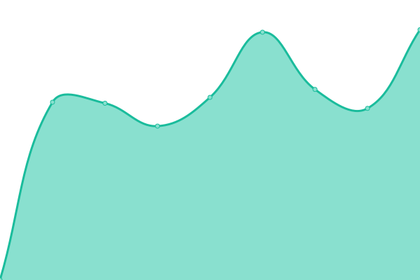 3589ms
     
 | 

<a href="https://up.pixelpirat.ch/history/wellenreiter">100.00%</a>
    

|  [AlegraCapital](https://www.alegracapital.com) | 🟩 Up | [alegra-capital.yml](https://github.com/kkehrer/upptime/commits/HEAD/history/alegra-capital.yml) | 

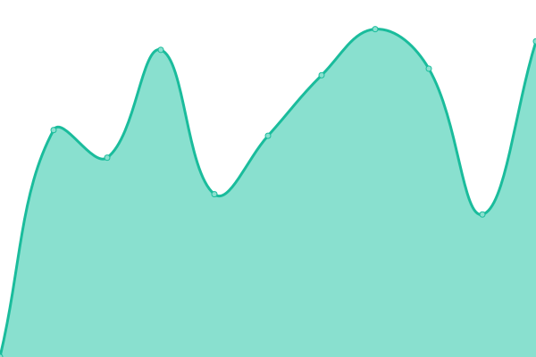 1151ms
     
 | 

<a href="https://up.pixelpirat.ch/history/alegra-capital">100.00%</a>
    

|  [Al-Pianton](https://www.al-pianton.ch) | 🟩 Up | [al-pianton.yml](https://github.com/kkehrer/upptime/commits/HEAD/history/al-pianton.yml) | 

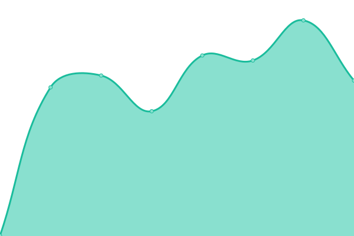 375ms
     
 | 

<a href="https://up.pixelpirat.ch/history/al-pianton">100.00%</a>
    

|  [Ammann-Ing](https://www.ammann-ing.ch) | 🟩 Up | [ammann-ing.yml](https://github.com/kkehrer/upptime/commits/HEAD/history/ammann-ing.yml) | 

 1193ms
     
 | 

<a href="https://up.pixelpirat.ch/history/ammann-ing">100.00%</a>
    

|  [Amosa](https://amosa.net) | 🟩 Up | [amosa.yml](https://github.com/kkehrer/upptime/commits/HEAD/history/amosa.yml) | 

 918ms
     
 | 

<a href="https://up.pixelpirat.ch/history/amosa">99.34%</a>
    

|  [Benz-Hauswartungen](https://www.benz-hauswartungen.ch) | 🟩 Up | [benz-hauswartungen.yml](https://github.com/kkehrer/upptime/commits/HEAD/history/benz-hauswartungen.yml) | 

 1917ms
     
 | 

<a href="https://up.pixelpirat.ch/history/benz-hauswartungen">100.00%</a>
    

|  [Blechworks](https://www.blechworks.ch) | 🟩 Up | [blechworks.yml](https://github.com/kkehrer/upptime/commits/HEAD/history/blechworks.yml) | 

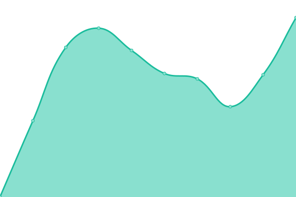 1570ms
     
 | 

<a href="https://up.pixelpirat.ch/history/blechworks">100.00%</a>
    

|  [Casanatale](https://www.casanatale.ch) | 🟩 Up | [casanatale.yml](https://github.com/kkehrer/upptime/commits/HEAD/history/casanatale.yml) | 

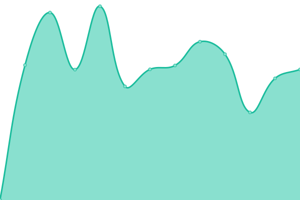 1347ms
     
 | 

<a href="https://up.pixelpirat.ch/history/casanatale">100.00%</a>
    

|  [Cevest](https://www.cevest.ch) | 🟩 Up | [cevest.yml](https://github.com/kkehrer/upptime/commits/HEAD/history/cevest.yml) | 

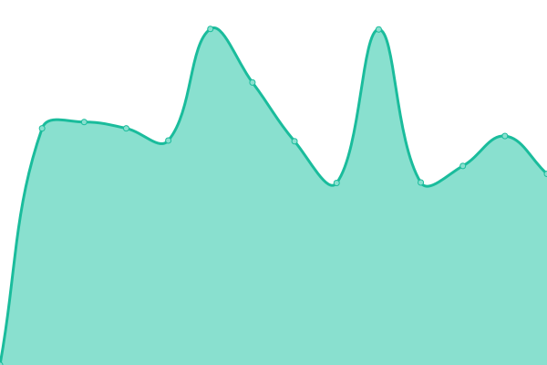 1515ms
     
 | 

<a href="https://up.pixelpirat.ch/history/cevest">100.00%</a>
    

|  [Christen-Metallbau](https://www.christen-metallbau.ch) | 🟩 Up | [christen-metallbau.yml](https://github.com/kkehrer/upptime/commits/HEAD/history/christen-metallbau.yml) | 

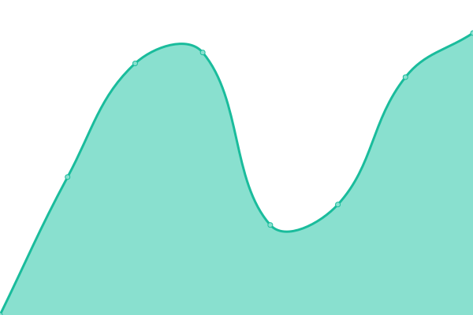 2165ms
     
 | 

<a href="https://up.pixelpirat.ch/history/christen-metallbau">100.00%</a>
    

|  [CP-Helmets](https://www.cp-helmets.com) | 🟩 Up | [cp-helmets.yml](https://github.com/kkehrer/upptime/commits/HEAD/history/cp-helmets.yml) | 

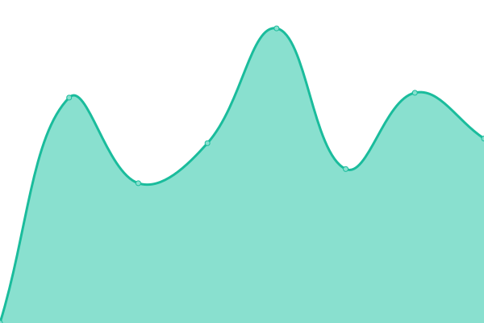 1077ms
     
 | 

<a href="https://up.pixelpirat.ch/history/cp-helmets">100.00%</a>
    

|  [Ecoreal](https://www.ecoreal.ch) | 🟩 Up | [ecoreal.yml](https://github.com/kkehrer/upptime/commits/HEAD/history/ecoreal.yml) | 

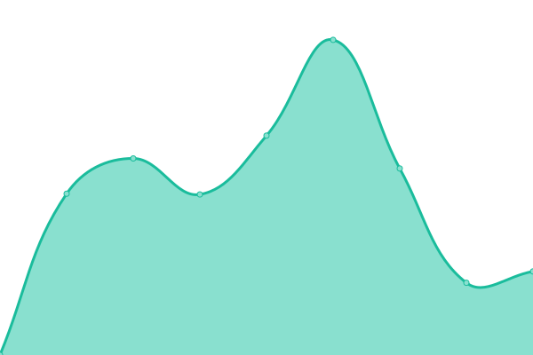 1594ms
     
 | 

<a href="https://up.pixelpirat.ch/history/ecoreal">100.00%</a>
    

|  [Fato-Reinigungen](https://www.fato-reinigungen.ch) | 🟩 Up | [fato-reinigungen.yml](https://github.com/kkehrer/upptime/commits/HEAD/history/fato-reinigungen.yml) | 

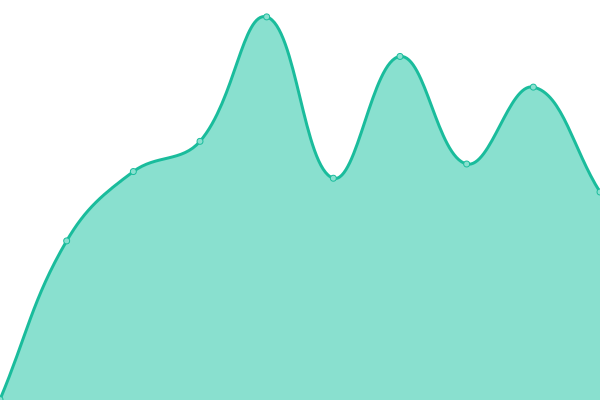 1359ms
     
 | 

<a href="https://up.pixelpirat.ch/history/fato-reinigungen">100.00%</a>
    

|  [Freiley](https://www.freiley.ch) | 🟩 Up | [freiley.yml](https://github.com/kkehrer/upptime/commits/HEAD/history/freiley.yml) | 

 453ms
     
 | 

<a href="https://up.pixelpirat.ch/history/freiley">100.00%</a>
    

|  [Gruenden](https://www.gruenden.ch/) | 🟩 Up | [gruenden.yml](https://github.com/kkehrer/upptime/commits/HEAD/history/gruenden.yml) | 

 1318ms
     
 | 

<a href="https://up.pixelpirat.ch/history/gruenden">100.00%</a>
    

|  [iwo](https://www.iwo.ch) | 🟩 Up | [iwo.yml](https://github.com/kkehrer/upptime/commits/HEAD/history/iwo.yml) | 

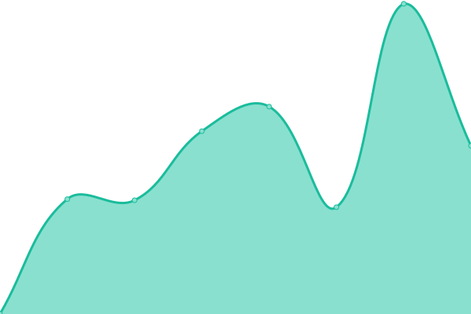 2762ms
     
 | 

<a href="https://up.pixelpirat.ch/history/iwo">100.00%</a>
    

|  [iwo-Wohnportal](https://www.iwo-wohnportal.ch) | 🟩 Up | [iwo-wohnportal.yml](https://github.com/kkehrer/upptime/commits/HEAD/history/iwo-wohnportal.yml) | 

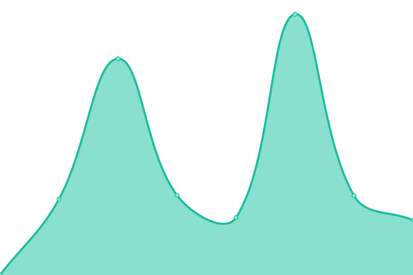 2192ms
     
 | 

<a href="https://up.pixelpirat.ch/history/iwo-wohnportal">100.00%</a>
    

|  [Kammerchor-ZO](https://www.kammerchor-zo.ch) | 🟩 Up | [kammerchor-zo.yml](https://github.com/kkehrer/upptime/commits/HEAD/history/kammerchor-zo.yml) | 

 1203ms
     
 | 

<a href="https://up.pixelpirat.ch/history/kammerchor-zo">100.00%</a>
    

|  [KAPAG](https://www.kapag.com) | 🟩 Up | [kapag.yml](https://github.com/kkehrer/upptime/commits/HEAD/history/kapag.yml) | 

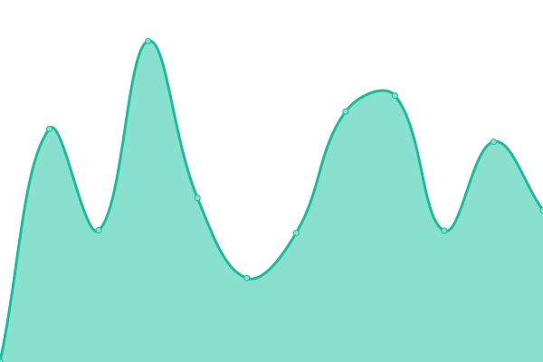 1253ms
     
 | 

<a href="https://up.pixelpirat.ch/history/kapag">99.92%</a>
    

|  [LSB](https://www.lsbag.ch) | 🟩 Up | [lsb.yml](https://github.com/kkehrer/upptime/commits/HEAD/history/lsb.yml) | 

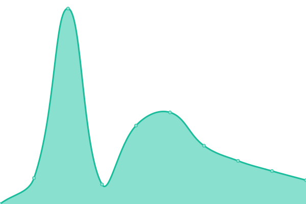 1605ms
     
 | 

<a href="https://up.pixelpirat.ch/history/lsb">100.00%</a>
    

|  [Oppboga](https://www.oppboga.com) | 🟩 Up | [oppboga.yml](https://github.com/kkehrer/upptime/commits/HEAD/history/oppboga.yml) | 

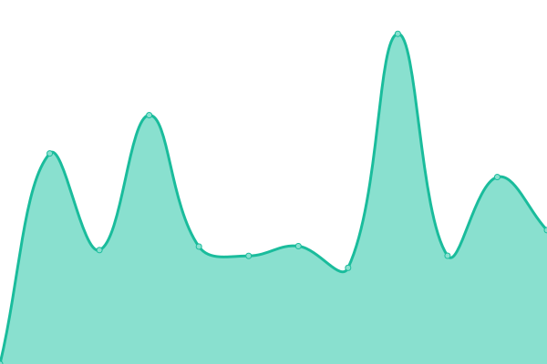 1103ms
     
 | 

<a href="https://up.pixelpirat.ch/history/oppboga">100.00%</a>
    

|  [Peyer-Marking](https://www.peyer-marking.ch) | 🟩 Up | [peyer-marking.yml](https://github.com/kkehrer/upptime/commits/HEAD/history/peyer-marking.yml) | 

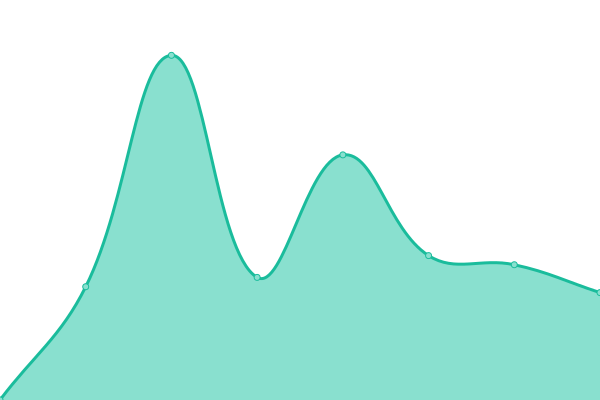 1661ms
     
 | 

<a href="https://up.pixelpirat.ch/history/peyer-marking">100.00%</a>
    

|  [RMC](https://www.rmc-consulting.ch) | 🟩 Up | [rmc.yml](https://github.com/kkehrer/upptime/commits/HEAD/history/rmc.yml) | 

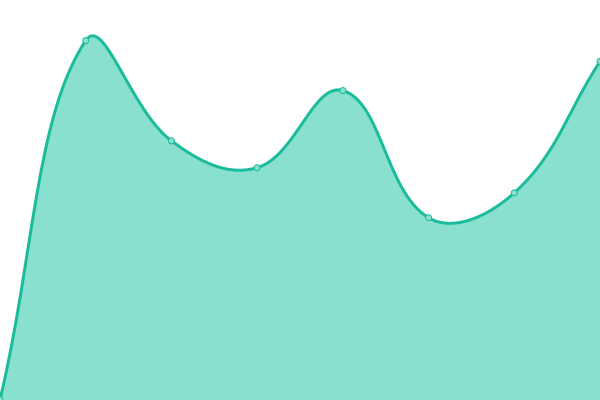 1095ms
     
 | 

<a href="https://up.pixelpirat.ch/history/rmc">100.00%</a>
    

|  [Scharlachrot](https://scharlachrot.ch) | 🟩 Up | [scharlachrot.yml](https://github.com/kkehrer/upptime/commits/HEAD/history/scharlachrot.yml) | 

 1491ms
     
 | 

<a href="https://up.pixelpirat.ch/history/scharlachrot">100.00%</a>
    

|  [Schartenfels-Immobilien](https://www.schartenfels-immobilien.ch) | 🟩 Up | [schartenfels-immobilien.yml](https://github.com/kkehrer/upptime/commits/HEAD/history/schartenfels-immobilien.yml) | 

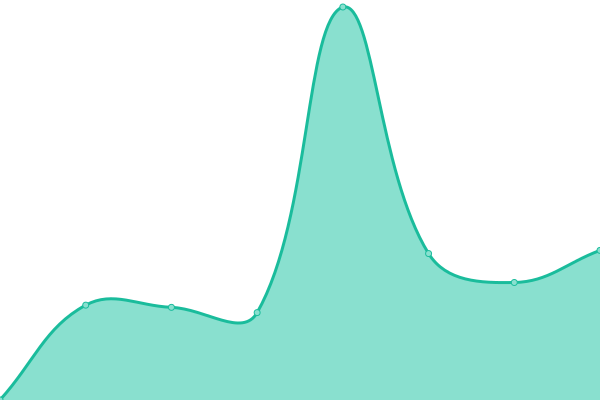 1445ms
     
 | 

<a href="https://up.pixelpirat.ch/history/schartenfels-immobilien">100.00%</a>
    

|  [SchmidReisen](https://www.schmidreisen.ch) | 🟩 Up | [schmid-reisen.yml](https://github.com/kkehrer/upptime/commits/HEAD/history/schmid-reisen.yml) | 

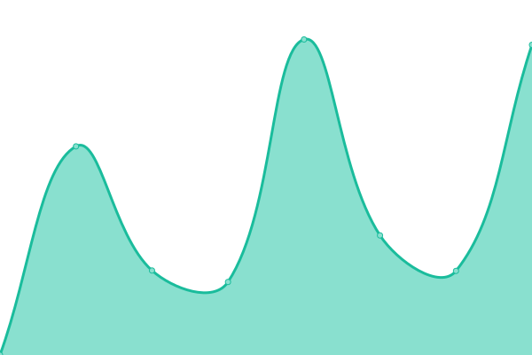 1618ms
     
 | 

<a href="https://up.pixelpirat.ch/history/schmid-reisen">100.00%</a>
    

|  [Tägi](https://www.taegi.ch) | 🟩 Up | [taegi.yml](https://github.com/kkehrer/upptime/commits/HEAD/history/taegi.yml) | 

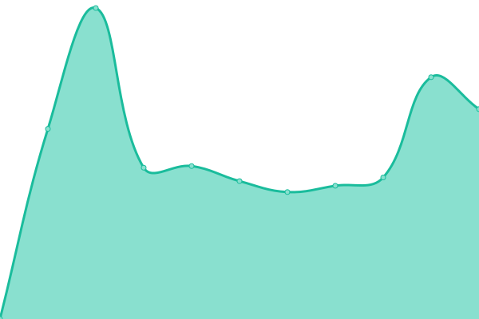 2488ms
     
 | 

<a href="https://up.pixelpirat.ch/history/taegi">100.00%</a>
    

|  [Tägi-Events](https://events.taegi.ch) | 🟩 Up | [taegi-events.yml](https://github.com/kkehrer/upptime/commits/HEAD/history/taegi-events.yml) | 

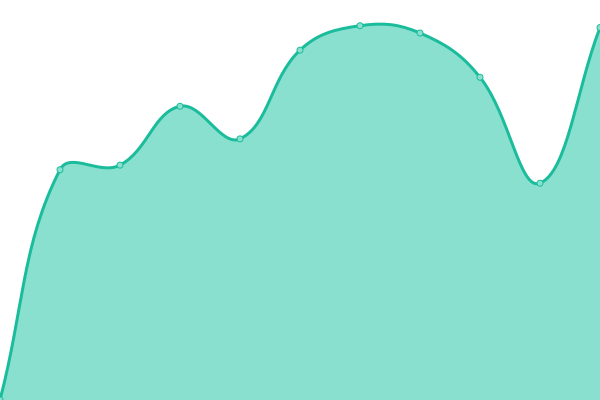 1726ms
     
 | 

<a href="https://up.pixelpirat.ch/history/taegi-events">100.00%</a>
    

|  [Taormina](https://www.taormina-law.ch) | 🟩 Up | [taormina.yml](https://github.com/kkehrer/upptime/commits/HEAD/history/taormina.yml) | 

 1515ms
     
 | 

<a href="https://up.pixelpirat.ch/history/taormina">100.00%</a>
    

|  [TXgroup](https://tx.group) | 🟩 Up | [t-xgroup.yml](https://github.com/kkehrer/upptime/commits/HEAD/history/t-xgroup.yml) | 

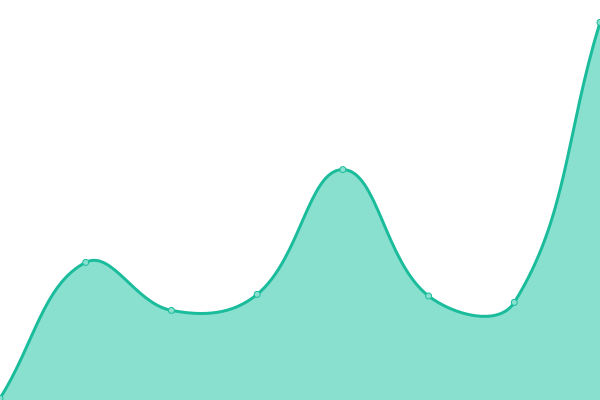 1859ms
     
 | 

<a href="https://up.pixelpirat.ch/history/t-xgroup">100.00%</a>
    

|  [TXgroup-Charts](https://proxy-prod.solutions.webfg.ch/mdp-auth/tamedia/v1/solid/quotes/tamedia/?listID=1117825-4-1) | 🟩 Up | [t-xgroup-charts.yml](https://github.com/kkehrer/upptime/commits/HEAD/history/t-xgroup-charts.yml) | 

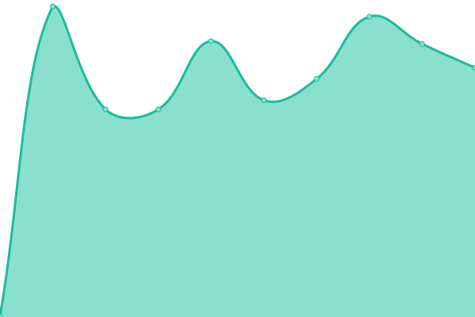 764ms
     
 | 

<a href="https://up.pixelpirat.ch/history/t-xgroup-charts">100.00%</a>
    

|  [UniqueReal](https://www.uniquereal.ch) | 🟩 Up | [unique-real.yml](https://github.com/kkehrer/upptime/commits/HEAD/history/unique-real.yml) | 

 1406ms
     
 | 

<a href="https://up.pixelpirat.ch/history/unique-real">100.00%</a>
    

|  [WSchneider](https://www.wschneider.com) | 🟩 Up | [w-schneider.yml](https://github.com/kkehrer/upptime/commits/HEAD/history/w-schneider.yml) | 

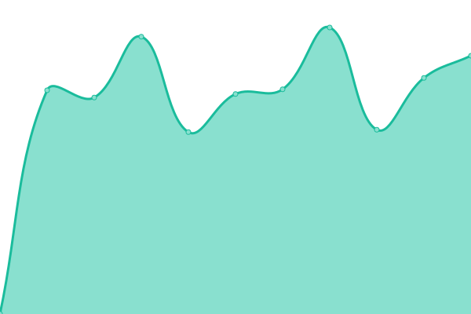 1076ms
     
 | 

<a href="https://up.pixelpirat.ch/history/w-schneider">100.00%</a>
    

<!--end: status pages-->

## 📄 License

- Powered by: [Upptime](https://github.com/upptime/upptime)
- Code: [MIT](./LICENSE) © [kkehrer](https://up.pixelpirat.ch)
- Data in the `./history` directory: [Open Database License](https://opendatacommons.org/licenses/odbl/1-0/)
