# [📈 Live Status](https://up.pixelpirat.ch): <!--live status--> **🟩 All systems operational**

This repository contains the open-source uptime monitor and status page for [kkehrer projects](https://up.pixelpirat.ch), powered by [Upptime](https://github.com/upptime/upptime).

<!--start: status pages-->
<!-- This summary is generated by Upptime (https://github.com/upptime/upptime) -->
<!-- Do not edit this manually, your changes will be overwritten -->
<!-- prettier-ignore -->
| URL | Status | History | Response Time | Uptime |
| --- | ------ | ------- | ------------- | ------ |
|  [Bartsch-Consulting](https://www.bartsch-consulting.ch) | 🟩 Up | [bartsch-consulting.yml](https://github.com/kkehrer/upptime/commits/HEAD/history/bartsch-consulting.yml) | 

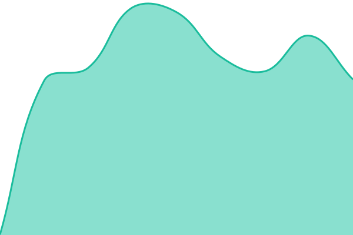 1475ms
     
 | 

<a href="https://up.digitalsource.ch/history/bartsch-consulting">99.83%</a>
    

|  [Cavedelorge](https://cavedelorge.ch) | 🟩 Up | [cavedelorge.yml](https://github.com/kkehrer/upptime/commits/HEAD/history/cavedelorge.yml) | 

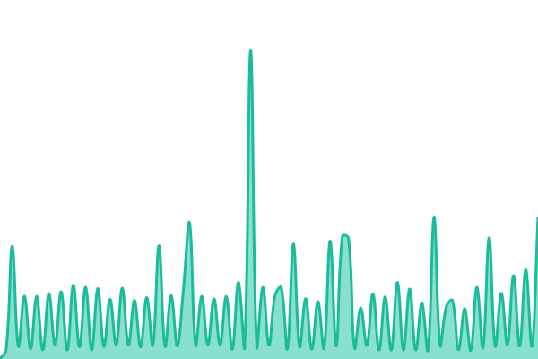 1754ms
     
 | 

<a href="https://up.digitalsource.ch/history/cavedelorge">84.18%</a>
    

|  [FelixAdvisory](https://felixadvisory.ch) | 🟩 Up | [felix-advisory.yml](https://github.com/kkehrer/upptime/commits/HEAD/history/felix-advisory.yml) | 

 820ms
     
 | 

<a href="https://up.digitalsource.ch/history/felix-advisory">100.00%</a>
    

|  [Goldhahn](https://goldhahn.swiss) | 🟩 Up | [goldhahn.yml](https://github.com/kkehrer/upptime/commits/HEAD/history/goldhahn.yml) | 

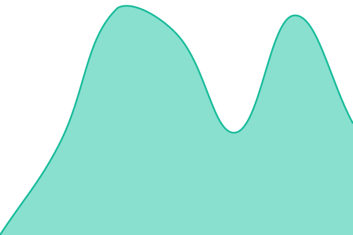 2853ms
     
 | 

<a href="https://up.digitalsource.ch/history/goldhahn">100.00%</a>
    

|  [kaikehrer](https://kaikehrer.ch) | 🟩 Up | [kaikehrer.yml](https://github.com/kkehrer/upptime/commits/HEAD/history/kaikehrer.yml) | 

 880ms
     
 | 

<a href="https://up.digitalsource.ch/history/kaikehrer">100.00%</a>
    

|  [licht](https://licht.kaikehrer.ch) | 🟩 Up | [licht.yml](https://github.com/kkehrer/upptime/commits/HEAD/history/licht.yml) | 

 811ms
     
 | 

<a href="https://up.digitalsource.ch/history/licht">100.00%</a>
    

|  [licht2](https://licht2.kaikehrer.ch) | 🟩 Up | [licht2.yml](https://github.com/kkehrer/upptime/commits/HEAD/history/licht2.yml) | 

 803ms
     
 | 

<a href="https://up.digitalsource.ch/history/licht2">100.00%</a>
    

|  [R2Partners](https://r2partnersag.ch) | 🟩 Up | [r2-partners.yml](https://github.com/kkehrer/upptime/commits/HEAD/history/r2-partners.yml) | 

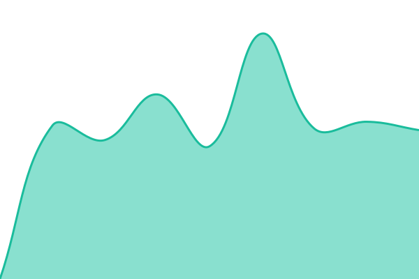 1382ms
     
 | 

<a href="https://up.digitalsource.ch/history/r2-partners">100.00%</a>
    

|  [Seilers-Werbeblog](https://www.seilers-werbeblog.ch) | 🟩 Up | [seilers-werbeblog.yml](https://github.com/kkehrer/upptime/commits/HEAD/history/seilers-werbeblog.yml) | 

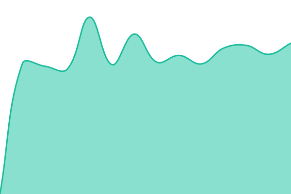 1447ms
     
 | 

<a href="https://up.digitalsource.ch/history/seilers-werbeblog">98.74%</a>
    

|  [StudioPM](https://studiopm.ch) | 🟩 Up | [studio-pm.yml](https://github.com/kkehrer/upptime/commits/HEAD/history/studio-pm.yml) | 

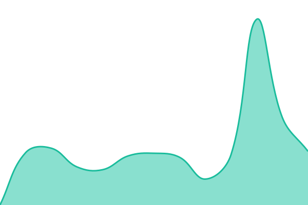 3666ms
     
 | 

<a href="https://up.digitalsource.ch/history/studio-pm">99.62%</a>
    

|  [Wellenreiter](https://www.wellenreiter.consulting) | 🟩 Up | [wellenreiter.yml](https://github.com/kkehrer/upptime/commits/HEAD/history/wellenreiter.yml) | 

 1763ms
     
 | 

<a href="https://up.digitalsource.ch/history/wellenreiter">100.00%</a>
    

|  [Photosphere](https://www.association-photosphere.ch) | 🟩 Up | [photosphere.yml](https://github.com/kkehrer/upptime/commits/HEAD/history/photosphere.yml) | 

 404ms
     
 | 

<a href="https://up.digitalsource.ch/history/photosphere">100.00%</a>
    

|  [Caminada](https://www.caminada.ch) | 🟩 Up | [caminada.yml](https://github.com/kkehrer/upptime/commits/HEAD/history/caminada.yml) | 

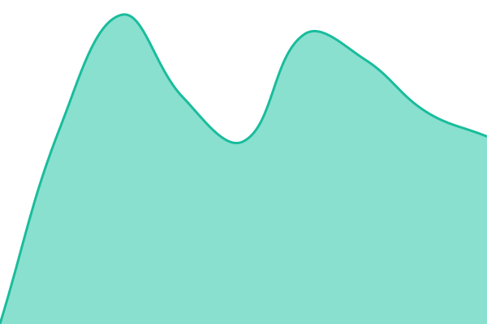 1157ms
     
 | 

<a href="https://up.digitalsource.ch/history/caminada">100.00%</a>
    

|  [Kammerchor-ZO](https://www.kammerchor-zo.ch) | 🟩 Up | [kammerchor-zo.yml](https://github.com/kkehrer/upptime/commits/HEAD/history/kammerchor-zo.yml) | 

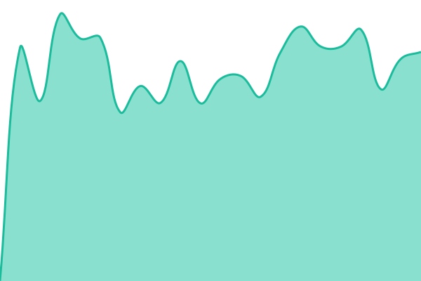 1569ms
     
 | 

<a href="https://up.digitalsource.ch/history/kammerchor-zo">93.48%</a>
    

|  [Peyer-Marking](https://www.peyer-marking.ch) | 🟩 Up | [peyer-marking.yml](https://github.com/kkehrer/upptime/commits/HEAD/history/peyer-marking.yml) | 

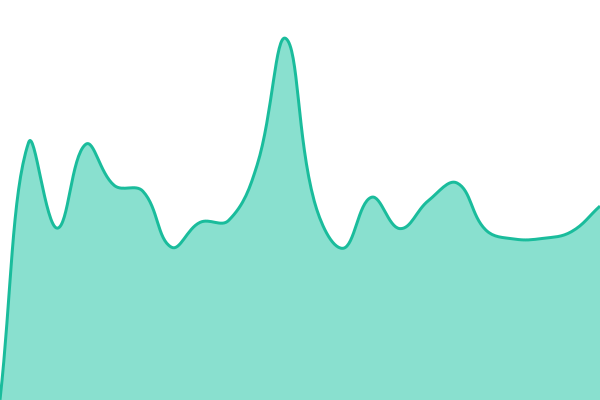 1239ms
     
 | 

<a href="https://up.digitalsource.ch/history/peyer-marking">94.55%</a>
    

|  [SchmidReisen](https://www.schmidreisen.ch) | 🟩 Up | [schmid-reisen.yml](https://github.com/kkehrer/upptime/commits/HEAD/history/schmid-reisen.yml) | 

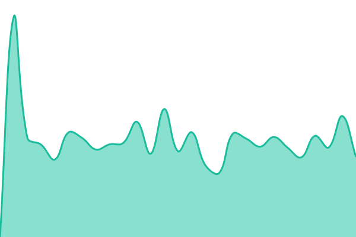 1004ms
     
 | 

<a href="https://up.digitalsource.ch/history/schmid-reisen">96.96%</a>
    

|  [Taormina](https://www.taormina-law.ch) | 🟩 Up | [taormina.yml](https://github.com/kkehrer/upptime/commits/HEAD/history/taormina.yml) | 

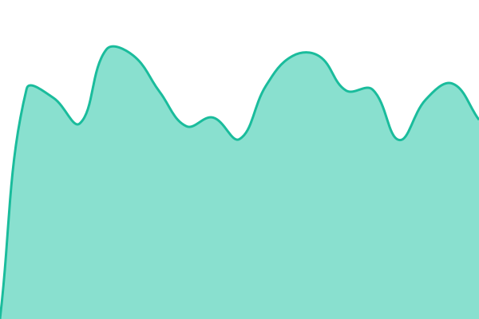 2121ms
     
 | 

<a href="https://up.digitalsource.ch/history/taormina">98.11%</a>
    

|  [UniqueReal](https://www.uniquereal.ch) | 🟩 Up | [unique-real.yml](https://github.com/kkehrer/upptime/commits/HEAD/history/unique-real.yml) | 

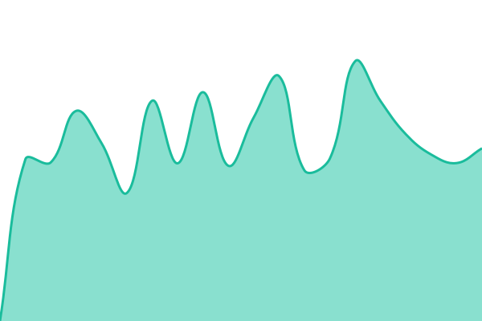 1444ms
     
 | 

<a href="https://up.digitalsource.ch/history/unique-real">98.39%</a>
    

<!--end: status pages-->

## 📄 License

- Powered by: [Upptime](https://github.com/upptime/upptime)
- Code: [MIT](./LICENSE) © [kkehrer](https://up.pixelpirat.ch)
- Data in the `./history` directory: [Open Database License](https://opendatacommons.org/licenses/odbl/1-0/)
