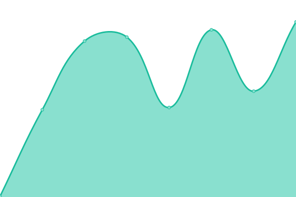

# [📈 Live Status](https://up.pixelpirat.ch): <!--live status--> **🟧 Partial outage**

This repository contains the open-source uptime monitor and status page for [kkehrer projects](https://up.pixelpirat.ch), powered by [Upptime](https://github.com/upptime/upptime).

<!--start: status pages-->
<!-- This summary is generated by Upptime (https://github.com/upptime/upptime) -->
<!-- Do not edit this manually, your changes will be overwritten -->
<!-- prettier-ignore -->
| URL | Status | History | Response Time | Uptime |
| --- | ------ | ------- | ------------- | ------ |
|  [Bartsch-Consulting](https://www.bartsch-consulting.ch) | 🟩 Up | [bartsch-consulting.yml](https://github.com/kkehrer/upptime/commits/HEAD/history/bartsch-consulting.yml) | 

 1144ms
     
 | 

<a href="https://up.digitalsource.ch/history/bartsch-consulting">100.00%</a>
    

|  [Cavedelorge](https://cavedelorge.ch) | 🟩 Up | [cavedelorge.yml](https://github.com/kkehrer/upptime/commits/HEAD/history/cavedelorge.yml) | 

 3429ms
     
 | 

<a href="https://up.digitalsource.ch/history/cavedelorge">99.65%</a>
    

|  [FelixAdvisory](https://felixadvisory.ch) | 🟩 Up | [felix-advisory.yml](https://github.com/kkehrer/upptime/commits/HEAD/history/felix-advisory.yml) | 

 1941ms
     
 | 

<a href="https://up.digitalsource.ch/history/felix-advisory">100.00%</a>
    

|  [Goldhahn](https://goldhahn.swiss) | 🟩 Up | [goldhahn.yml](https://github.com/kkehrer/upptime/commits/HEAD/history/goldhahn.yml) | 

 4665ms
     
 | 

<a href="https://up.digitalsource.ch/history/goldhahn">100.00%</a>
    

|  [Ine.rave](https://www.ine-rave.com) | 🟩 Up | [ine-rave.yml](https://github.com/kkehrer/upptime/commits/HEAD/history/ine-rave.yml) | 

 1078ms
     
 | 

<a href="https://up.digitalsource.ch/history/ine-rave">100.00%</a>
    

|  [kaikehrer](https://kaikehrer.ch) | 🟥 Down | [kaikehrer.yml](https://github.com/kkehrer/upptime/commits/HEAD/history/kaikehrer.yml) | 

 626ms
     
 | 

<a href="https://up.digitalsource.ch/history/kaikehrer">99.71%</a>
    

|  [Keey](https://keey.ch) | 🟩 Up | [keey.yml](https://github.com/kkehrer/upptime/commits/HEAD/history/keey.yml) | 

 2106ms
     
 | 

<a href="https://up.digitalsource.ch/history/keey">98.22%</a>
    

|  [PixelPirat](https://pixelpirat.ch) | 🟥 Down | [pixel-pirat.yml](https://github.com/kkehrer/upptime/commits/HEAD/history/pixel-pirat.yml) | 

 647ms
     
 | 

<a href="https://up.digitalsource.ch/history/pixel-pirat">99.72%</a>
    

|  [R2Partners](https://r2partnersag.ch) | 🟩 Up | [r2-partners.yml](https://github.com/kkehrer/upptime/commits/HEAD/history/r2-partners.yml) | 

 994ms
     
 | 

<a href="https://up.digitalsource.ch/history/r2-partners">100.00%</a>
    

|  [Seilers-Werbeblog](https://www.seilers-werbeblog.ch) | 🟩 Up | [seilers-werbeblog.yml](https://github.com/kkehrer/upptime/commits/HEAD/history/seilers-werbeblog.yml) | 

 1591ms
     
 | 

<a href="https://up.digitalsource.ch/history/seilers-werbeblog">98.30%</a>
    

|  [StudioPM](https://studiopm.ch) | 🟩 Up | [studio-pm.yml](https://github.com/kkehrer/upptime/commits/HEAD/history/studio-pm.yml) | 

 4234ms
     
 | 

<a href="https://up.digitalsource.ch/history/studio-pm">98.37%</a>
    

|  [Wellenreiter](https://www.wellenreiter.consulting) | 🟩 Up | [wellenreiter.yml](https://github.com/kkehrer/upptime/commits/HEAD/history/wellenreiter.yml) | 

 3996ms
     
 | 

<a href="https://up.digitalsource.ch/history/wellenreiter">100.00%</a>
    

|  [AlegraCapital](https://www.alegracapital.com) | 🟩 Up | [alegra-capital.yml](https://github.com/kkehrer/upptime/commits/HEAD/history/alegra-capital.yml) | 

 1738ms
     
 | 

<a href="https://up.digitalsource.ch/history/alegra-capital">98.14%</a>
    

|  [Ammann-Ing](https://www.ammann-ing.ch) | 🟩 Up | [ammann-ing.yml](https://github.com/kkehrer/upptime/commits/HEAD/history/ammann-ing.yml) | 

 989ms
     
 | 

<a href="https://up.digitalsource.ch/history/ammann-ing">98.22%</a>
    

|  [Amosa](https://amosa.net) | 🟩 Up | [amosa.yml](https://github.com/kkehrer/upptime/commits/HEAD/history/amosa.yml) | 

 945ms
     
 | 

<a href="https://up.digitalsource.ch/history/amosa">100.00%</a>
    

|  [Photosphere](https://www.association-photosphere.ch) | 🟩 Up | [photosphere.yml](https://github.com/kkehrer/upptime/commits/HEAD/history/photosphere.yml) | 

 601ms
     
 | 

<a href="https://up.digitalsource.ch/history/photosphere">100.00%</a>
    

|  [Blechworks](https://www.blechworks.ch) | 🟩 Up | [blechworks.yml](https://github.com/kkehrer/upptime/commits/HEAD/history/blechworks.yml) | 

 961ms
     
 | 

<a href="https://up.digitalsource.ch/history/blechworks">96.73%</a>
    

|  [Caminada](https://www.caminada.ch) | 🟩 Up | [caminada.yml](https://github.com/kkehrer/upptime/commits/HEAD/history/caminada.yml) | 

 1422ms
     
 | 

<a href="https://up.digitalsource.ch/history/caminada">100.00%</a>
    

|  [Casanatale](https://www.casanatale.ch) | 🟩 Up | [casanatale.yml](https://github.com/kkehrer/upptime/commits/HEAD/history/casanatale.yml) | 

 1941ms
     
 | 

<a href="https://up.digitalsource.ch/history/casanatale">98.38%</a>
    

|  [Cevest](https://www.cevest.ch) | 🟩 Up | [cevest.yml](https://github.com/kkehrer/upptime/commits/HEAD/history/cevest.yml) | 

 1903ms
     
 | 

<a href="https://up.digitalsource.ch/history/cevest">98.46%</a>
    

|  [Christen-Metallbau](https://www.christen-metallbau.ch) | 🟩 Up | [christen-metallbau.yml](https://github.com/kkehrer/upptime/commits/HEAD/history/christen-metallbau.yml) | 

 2516ms
     
 | 

<a href="https://up.digitalsource.ch/history/christen-metallbau">98.54%</a>
    

|  [Ecoreal](https://www.ecoreal.ch) | 🟩 Up | [ecoreal.yml](https://github.com/kkehrer/upptime/commits/HEAD/history/ecoreal.yml) | 

 1817ms
     
 | 

<a href="https://up.digitalsource.ch/history/ecoreal">98.62%</a>
    

|  [Fato-Reinigungen](https://www.fato-reinigungen.ch) | 🟩 Up | [fato-reinigungen.yml](https://github.com/kkehrer/upptime/commits/HEAD/history/fato-reinigungen.yml) | 

 439ms
     
 | 

<a href="https://up.digitalsource.ch/history/fato-reinigungen">100.00%</a>
    

|  [Gruenden](https://www.gruenden.ch/) | 🟩 Up | [gruenden.yml](https://github.com/kkehrer/upptime/commits/HEAD/history/gruenden.yml) | 

 1090ms
     
 | 

<a href="https://up.digitalsource.ch/history/gruenden">100.00%</a>
    

|  [Kammerchor-ZO](https://www.kammerchor-zo.ch) | 🟩 Up | [kammerchor-zo.yml](https://github.com/kkehrer/upptime/commits/HEAD/history/kammerchor-zo.yml) | 

 1827ms
     
 | 

<a href="https://up.digitalsource.ch/history/kammerchor-zo">98.69%</a>
    

|  [KAPAG](https://www.kapag.com) | 🟩 Up | [kapag.yml](https://github.com/kkehrer/upptime/commits/HEAD/history/kapag.yml) | 

 2057ms
     
 | 

<a href="https://up.digitalsource.ch/history/kapag">98.77%</a>
    

|  [LSB](https://www.lsbag.ch) | 🟩 Up | [lsb.yml](https://github.com/kkehrer/upptime/commits/HEAD/history/lsb.yml) | 

 1899ms
     
 | 

<a href="https://up.digitalsource.ch/history/lsb">98.85%</a>
    

|  [Oppboga](https://www.oppboga.com) | 🟩 Up | [oppboga.yml](https://github.com/kkehrer/upptime/commits/HEAD/history/oppboga.yml) | 

 2321ms
     
 | 

<a href="https://up.digitalsource.ch/history/oppboga">98.95%</a>
    

|  [Peyer-Marking](https://www.peyer-marking.ch) | 🟩 Up | [peyer-marking.yml](https://github.com/kkehrer/upptime/commits/HEAD/history/peyer-marking.yml) | 

 2920ms
     
 | 

<a href="https://up.digitalsource.ch/history/peyer-marking">99.05%</a>
    

|  [Scarlet-Studio](https://scarlet.studio) | 🟩 Up | [scarlet-studio.yml](https://github.com/kkehrer/upptime/commits/HEAD/history/scarlet-studio.yml) | 

 1119ms
     
 | 

<a href="https://up.digitalsource.ch/history/scarlet-studio">99.15%</a>
    

|  [SchmidReisen](https://www.schmidreisen.ch) | 🟩 Up | [schmid-reisen.yml](https://github.com/kkehrer/upptime/commits/HEAD/history/schmid-reisen.yml) | 

 2106ms
     
 | 

<a href="https://up.digitalsource.ch/history/schmid-reisen">99.24%</a>
    

|  [Tägi](https://www.taegi.ch) | 🟩 Up | [taegi.yml](https://github.com/kkehrer/upptime/commits/HEAD/history/taegi.yml) | 

 1705ms
     
 | 

<a href="https://up.digitalsource.ch/history/taegi">99.47%</a>
    

|  [Tägi-Events](https://events.taegi.ch) | 🟩 Up | [taegi-events.yml](https://github.com/kkehrer/upptime/commits/HEAD/history/taegi-events.yml) | 

 2411ms
     
 | 

<a href="https://up.digitalsource.ch/history/taegi-events">99.82%</a>
    

|  [Taormina](https://www.taormina-law.ch) | 🟩 Up | [taormina.yml](https://github.com/kkehrer/upptime/commits/HEAD/history/taormina.yml) | 

 2162ms
     
 | 

<a href="https://up.digitalsource.ch/history/taormina">99.84%</a>
    

|  [TXgroup](https://tx.group) | 🟥 Down | [t-xgroup.yml](https://github.com/kkehrer/upptime/commits/HEAD/history/t-xgroup.yml) | 

 227ms
     
 | 

<a href="https://up.digitalsource.ch/history/t-xgroup">0.00%</a>
    

|  [TXgroup-Ticker](https://tools.eurolandir.com/tools/ticker/html/?companycode=CH-TAMN&v=static&lang=en-GB) | 🟩 Up | [t-xgroup-ticker.yml](https://github.com/kkehrer/upptime/commits/HEAD/history/t-xgroup-ticker.yml) | 

 1555ms
     
 | 

<a href="https://up.digitalsource.ch/history/t-xgroup-ticker">100.00%</a>
    

|  [TXgroup-SharePriceOverview](https://tools.eurolandir.com/tools/ticker/html/?companycode=CH-TAMN&v=chart&lang=en-GB) | 🟩 Up | [t-xgroup-share-price-overview.yml](https://github.com/kkehrer/upptime/commits/HEAD/history/t-xgroup-share-price-overview.yml) | 

 1928ms
     
 | 

<a href="https://up.digitalsource.ch/history/t-xgroup-share-price-overview">100.00%</a>
    

|  [TXgroup-SharePriceDetail](https://tools.eurolandir.com/tools/custom/CH-TAMN/bundle.html?lang=en-GB) | 🟩 Up | [t-xgroup-share-price-detail.yml](https://github.com/kkehrer/upptime/commits/HEAD/history/t-xgroup-share-price-detail.yml) | 

 118ms
     
 | 

<a href="https://up.digitalsource.ch/history/t-xgroup-share-price-detail">100.00%</a>
    

|  [TXgroup-ShareSeries](https://tools.eurolandir.com/tools/shareseries/?companycode=CH-TAMN&lang=en-GB) | 🟩 Up | [t-xgroup-share-series.yml](https://github.com/kkehrer/upptime/commits/HEAD/history/t-xgroup-share-series.yml) | 

 1766ms
     
 | 

<a href="https://up.digitalsource.ch/history/t-xgroup-share-series">100.00%</a>
    

|  [UniqueReal](https://www.uniquereal.ch) | 🟩 Up | [unique-real.yml](https://github.com/kkehrer/upptime/commits/HEAD/history/unique-real.yml) | 

 1856ms
     
 | 

<a href="https://up.digitalsource.ch/history/unique-real">100.00%</a>
    

<!--end: status pages-->

## 📄 License

- Powered by: [Upptime](https://github.com/upptime/upptime)
- Code: [MIT](./LICENSE) © [kkehrer](https://up.pixelpirat.ch)
- Data in the `./history` directory: [Open Database License](https://opendatacommons.org/licenses/odbl/1-0/)
