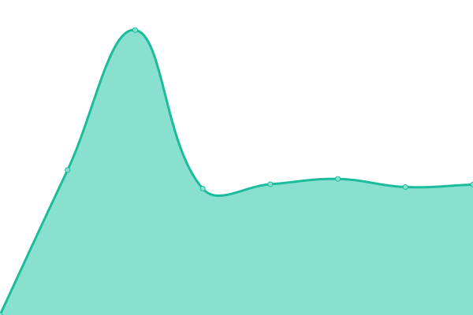

# [📈 Live Status](https://up.pixelpirat.ch): <!--live status--> **🟧 Partial outage**

This repository contains the open-source uptime monitor and status page for [kkehrer projects](https://up.pixelpirat.ch), powered by [Upptime](https://github.com/upptime/upptime).

<!--start: status pages-->
<!-- This summary is generated by Upptime (https://github.com/upptime/upptime) -->
<!-- Do not edit this manually, your changes will be overwritten -->
<!-- prettier-ignore -->
| URL | Status | History | Response Time | Uptime |
| --- | ------ | ------- | ------------- | ------ |
|  [Bartsch-Consulting](https://www.bartsch-consulting.ch) | 🟩 Up | [bartsch-consulting.yml](https://github.com/kkehrer/upptime/commits/HEAD/history/bartsch-consulting.yml) | 

 2006ms
     
 | 

<a href="https://up.digitalsource.ch/history/bartsch-consulting">99.78%</a>
    

|  [Cavedelorge](https://cavedelorge.ch) | 🟩 Up | [cavedelorge.yml](https://github.com/kkehrer/upptime/commits/HEAD/history/cavedelorge.yml) | 

 2207ms
     
 | 

<a href="https://up.digitalsource.ch/history/cavedelorge">100.00%</a>
    

|  [FelixAdvisory](https://felixadvisory.ch) | 🟩 Up | [felix-advisory.yml](https://github.com/kkehrer/upptime/commits/HEAD/history/felix-advisory.yml) | 

 1287ms
     
 | 

<a href="https://up.digitalsource.ch/history/felix-advisory">100.00%</a>
    

|  [Goldhahn](https://goldhahn.swiss) | 🟩 Up | [goldhahn.yml](https://github.com/kkehrer/upptime/commits/HEAD/history/goldhahn.yml) | 

 3453ms
     
 | 

<a href="https://up.digitalsource.ch/history/goldhahn">99.51%</a>
    

|  [Ine.rave](https://www.ine-rave.com) | 🟩 Up | [ine-rave.yml](https://github.com/kkehrer/upptime/commits/HEAD/history/ine-rave.yml) | 

 1082ms
     
 | 

<a href="https://up.digitalsource.ch/history/ine-rave">100.00%</a>
    

|  [kaikehrer](https://kaikehrer.ch) | 🟩 Up | [kaikehrer.yml](https://github.com/kkehrer/upptime/commits/HEAD/history/kaikehrer.yml) | 

 1573ms
     
 | 

<a href="https://up.digitalsource.ch/history/kaikehrer">100.00%</a>
    

|  [Keey](https://keey.ch) | 🟩 Up | [keey.yml](https://github.com/kkehrer/upptime/commits/HEAD/history/keey.yml) | 

 1890ms
     
 | 

<a href="https://up.digitalsource.ch/history/keey">99.53%</a>
    

|  [PixelPirat](https://pixelpirat.ch) | 🟩 Up | [pixel-pirat.yml](https://github.com/kkehrer/upptime/commits/HEAD/history/pixel-pirat.yml) | 

 643ms
     
 | 

<a href="https://up.digitalsource.ch/history/pixel-pirat">100.00%</a>
    

|  [R2Partners](https://r2partnersag.ch) | 🟩 Up | [r2-partners.yml](https://github.com/kkehrer/upptime/commits/HEAD/history/r2-partners.yml) | 

 1557ms
     
 | 

<a href="https://up.digitalsource.ch/history/r2-partners">100.00%</a>
    

|  [Seilers-Werbeblog](https://www.seilers-werbeblog.ch) | 🟩 Up | [seilers-werbeblog.yml](https://github.com/kkehrer/upptime/commits/HEAD/history/seilers-werbeblog.yml) | 

 2166ms
     
 | 

<a href="https://up.digitalsource.ch/history/seilers-werbeblog">99.56%</a>
    

|  [StudioPM](https://studiopm.ch) | 🟩 Up | [studio-pm.yml](https://github.com/kkehrer/upptime/commits/HEAD/history/studio-pm.yml) | 

 3685ms
     
 | 

<a href="https://up.digitalsource.ch/history/studio-pm">99.58%</a>
    

|  [Wellenreiter](https://www.wellenreiter.consulting) | 🟩 Up | [wellenreiter.yml](https://github.com/kkehrer/upptime/commits/HEAD/history/wellenreiter.yml) | 

 4229ms
     
 | 

<a href="https://up.digitalsource.ch/history/wellenreiter">100.00%</a>
    

|  [AlegraCapital](https://www.alegracapital.com) | 🟩 Up | [alegra-capital.yml](https://github.com/kkehrer/upptime/commits/HEAD/history/alegra-capital.yml) | 

 1612ms
     
 | 

<a href="https://up.digitalsource.ch/history/alegra-capital">99.03%</a>
    

|  [Amosa](https://amosa.net) | 🟩 Up | [amosa.yml](https://github.com/kkehrer/upptime/commits/HEAD/history/amosa.yml) | 

 1222ms
     
 | 

<a href="https://up.digitalsource.ch/history/amosa">99.88%</a>
    

|  [Photosphere](https://www.association-photosphere.ch) | 🟩 Up | [photosphere.yml](https://github.com/kkehrer/upptime/commits/HEAD/history/photosphere.yml) | 

 1538ms
     
 | 

<a href="https://up.digitalsource.ch/history/photosphere">100.00%</a>
    

|  [Blechworks](https://www.blechworks.ch) | 🟩 Up | [blechworks.yml](https://github.com/kkehrer/upptime/commits/HEAD/history/blechworks.yml) | 

 725ms
     
 | 

<a href="https://up.digitalsource.ch/history/blechworks">99.63%</a>
    

|  [Caminada](https://www.caminada.ch) | 🟩 Up | [caminada.yml](https://github.com/kkehrer/upptime/commits/HEAD/history/caminada.yml) | 

 1436ms
     
 | 

<a href="https://up.digitalsource.ch/history/caminada">100.00%</a>
    

|  [Casanatale](https://www.casanatale.ch) | 🟩 Up | [casanatale.yml](https://github.com/kkehrer/upptime/commits/HEAD/history/casanatale.yml) | 

 1831ms
     
 | 

<a href="https://up.digitalsource.ch/history/casanatale">99.08%</a>
    

|  [Cevest](https://www.cevest.ch) | 🟩 Up | [cevest.yml](https://github.com/kkehrer/upptime/commits/HEAD/history/cevest.yml) | 

 2033ms
     
 | 

<a href="https://up.digitalsource.ch/history/cevest">99.11%</a>
    

|  [Christen-Metallbau](https://www.christen-metallbau.ch) | 🟩 Up | [christen-metallbau.yml](https://github.com/kkehrer/upptime/commits/HEAD/history/christen-metallbau.yml) | 

 2953ms
     
 | 

<a href="https://up.digitalsource.ch/history/christen-metallbau">99.11%</a>
    

|  [Ecoreal](https://www.ecoreal.ch) | 🟩 Up | [ecoreal.yml](https://github.com/kkehrer/upptime/commits/HEAD/history/ecoreal.yml) | 

 779ms
     
 | 

<a href="https://up.digitalsource.ch/history/ecoreal">0.00%</a>
    

|  [Fato-Reinigungen](https://www.fato-reinigungen.ch) | 🟩 Up | [fato-reinigungen.yml](https://github.com/kkehrer/upptime/commits/HEAD/history/fato-reinigungen.yml) | 

 492ms
     
 | 

<a href="https://up.digitalsource.ch/history/fato-reinigungen">100.00%</a>
    

|  [Gruenden](https://www.gruenden.ch/) | 🟩 Up | [gruenden.yml](https://github.com/kkehrer/upptime/commits/HEAD/history/gruenden.yml) | 

 1132ms
     
 | 

<a href="https://up.digitalsource.ch/history/gruenden">100.00%</a>
    

|  [Kammerchor-ZO](https://www.kammerchor-zo.ch) | 🟩 Up | [kammerchor-zo.yml](https://github.com/kkehrer/upptime/commits/HEAD/history/kammerchor-zo.yml) | 

 1777ms
     
 | 

<a href="https://up.digitalsource.ch/history/kammerchor-zo">99.73%</a>
    

|  [Peyer-Marking](https://www.peyer-marking.ch) | 🟩 Up | [peyer-marking.yml](https://github.com/kkehrer/upptime/commits/HEAD/history/peyer-marking.yml) | 

 1805ms
     
 | 

<a href="https://up.digitalsource.ch/history/peyer-marking">99.75%</a>
    

|  [Scarlet-Studio](https://scarlet.studio) | 🟩 Up | [scarlet-studio.yml](https://github.com/kkehrer/upptime/commits/HEAD/history/scarlet-studio.yml) | 

 854ms
     
 | 

<a href="https://up.digitalsource.ch/history/scarlet-studio">99.77%</a>
    

|  [SchmidReisen](https://www.schmidreisen.ch) | 🟩 Up | [schmid-reisen.yml](https://github.com/kkehrer/upptime/commits/HEAD/history/schmid-reisen.yml) | 

 2664ms
     
 | 

<a href="https://up.digitalsource.ch/history/schmid-reisen">99.80%</a>
    

|  [Tägi](https://www.taegi.ch) | 🟩 Up | [taegi.yml](https://github.com/kkehrer/upptime/commits/HEAD/history/taegi.yml) | 

 1836ms
     
 | 

<a href="https://up.digitalsource.ch/history/taegi">99.82%</a>
    

|  [Tägi-Events](https://events.taegi.ch) | 🟩 Up | [taegi-events.yml](https://github.com/kkehrer/upptime/commits/HEAD/history/taegi-events.yml) | 

 4383ms
     
 | 

<a href="https://up.digitalsource.ch/history/taegi-events">99.16%</a>
    

|  [Taormina](https://www.taormina-law.ch) | 🟩 Up | [taormina.yml](https://github.com/kkehrer/upptime/commits/HEAD/history/taormina.yml) | 

 2260ms
     
 | 

<a href="https://up.digitalsource.ch/history/taormina">99.80%</a>
    

|  [TXgroup](https://tx.group) | 🟥 Down | [t-xgroup.yml](https://github.com/kkehrer/upptime/commits/HEAD/history/t-xgroup.yml) | 

 344ms
     
 | 

<a href="https://up.digitalsource.ch/history/t-xgroup">0.00%</a>
    

|  [TXgroup-Ticker](https://tools.eurolandir.com/tools/ticker/html/?companycode=CH-TAMN&v=static&lang=en-GB) | 🟩 Up | [t-xgroup-ticker.yml](https://github.com/kkehrer/upptime/commits/HEAD/history/t-xgroup-ticker.yml) | 

 458ms
     
 | 

<a href="https://up.digitalsource.ch/history/t-xgroup-ticker">36.86%</a>
    

|  [TXgroup-SharePriceOverview](https://tools.eurolandir.com/tools/ticker/html/?companycode=CH-TAMN&v=chart&lang=en-GB) | 🟩 Up | [t-xgroup-share-price-overview.yml](https://github.com/kkehrer/upptime/commits/HEAD/history/t-xgroup-share-price-overview.yml) | 

 218ms
     
 | 

<a href="https://up.digitalsource.ch/history/t-xgroup-share-price-overview">100.00%</a>
    

|  [TXgroup-SharePriceDetail](https://tools.eurolandir.com/tools/custom/CH-TAMN/bundle.html?lang=en-GB) | 🟩 Up | [t-xgroup-share-price-detail.yml](https://github.com/kkehrer/upptime/commits/HEAD/history/t-xgroup-share-price-detail.yml) | 

 105ms
     
 | 

<a href="https://up.digitalsource.ch/history/t-xgroup-share-price-detail">100.00%</a>
    

|  [TXgroup-ShareSeries](https://tools.eurolandir.com/tools/shareseries/?companycode=CH-TAMN&lang=en-GB) | 🟩 Up | [t-xgroup-share-series.yml](https://github.com/kkehrer/upptime/commits/HEAD/history/t-xgroup-share-series.yml) | 

 134ms
     
 | 

<a href="https://up.digitalsource.ch/history/t-xgroup-share-series">100.00%</a>
    

|  [UniqueReal](https://www.uniquereal.ch) | 🟩 Up | [unique-real.yml](https://github.com/kkehrer/upptime/commits/HEAD/history/unique-real.yml) | 

 1940ms
     
 | 

<a href="https://up.digitalsource.ch/history/unique-real">99.44%</a>
    

<!--end: status pages-->

## 📄 License

- Powered by: [Upptime](https://github.com/upptime/upptime)
- Code: [MIT](./LICENSE) © [kkehrer](https://up.pixelpirat.ch)
- Data in the `./history` directory: [Open Database License](https://opendatacommons.org/licenses/odbl/1-0/)
