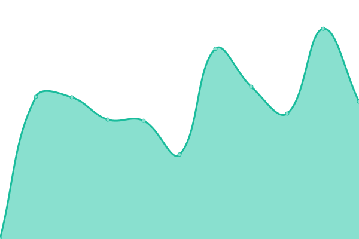

# [📈 Live Status](https://up.pixelpirat.ch): <!--live status--> **🟧 Partial outage**

This repository contains the open-source uptime monitor and status page for [kkehrer projects](https://up.pixelpirat.ch), powered by [Upptime](https://github.com/upptime/upptime).

<!--start: status pages-->
<!-- This summary is generated by Upptime (https://github.com/upptime/upptime) -->
<!-- Do not edit this manually, your changes will be overwritten -->
<!-- prettier-ignore -->
| URL | Status | History | Response Time | Uptime |
| --- | ------ | ------- | ------------- | ------ |
|  [Bartsch-Consulting](https://www.bartsch-consulting.ch) | 🟩 Up | [bartsch-consulting.yml](https://github.com/kkehrer/upptime/commits/HEAD/history/bartsch-consulting.yml) | 

 1239ms
     
 | 

<a href="https://up.pixelpirat.ch/history/bartsch-consulting">100.00%</a>
    

|  [Bitowl](https://bitowl.ch) | 🟥 Down | [bitowl.yml](https://github.com/kkehrer/upptime/commits/HEAD/history/bitowl.yml) | 

 101ms
     
 | 

<a href="https://up.pixelpirat.ch/history/bitowl">0.00%</a>
    

|  [Cavedelorge](https://cavedelorge.ch) | 🟩 Up | [cavedelorge.yml](https://github.com/kkehrer/upptime/commits/HEAD/history/cavedelorge.yml) | 

 2341ms
     
 | 

<a href="https://up.pixelpirat.ch/history/cavedelorge">100.00%</a>
    

|  [Goldhahn](https://goldhahn.swiss) | 🟩 Up | [goldhahn.yml](https://github.com/kkehrer/upptime/commits/HEAD/history/goldhahn.yml) | 

 3207ms
     
 | 

<a href="https://up.pixelpirat.ch/history/goldhahn">100.00%</a>
    

|  [Ine.rave](https://www.ine-rave.com) | 🟩 Up | [ine-rave.yml](https://github.com/kkehrer/upptime/commits/HEAD/history/ine-rave.yml) | 

 1303ms
     
 | 

<a href="https://up.pixelpirat.ch/history/ine-rave">100.00%</a>
    

|  [Keey](https://keey.ch) | 🟩 Up | [keey.yml](https://github.com/kkehrer/upptime/commits/HEAD/history/keey.yml) | 

 2142ms
     
 | 

<a href="https://up.pixelpirat.ch/history/keey">100.00%</a>
    

|  [PixelPirat](https://pixelpirat.ch) | 🟩 Up | [pixel-pirat.yml](https://github.com/kkehrer/upptime/commits/HEAD/history/pixel-pirat.yml) | 

 1865ms
     
 | 

<a href="https://up.pixelpirat.ch/history/pixel-pirat">100.00%</a>
    

|  [Seilers-Werbeblog](https://www.seilers-werbeblog.ch) | 🟩 Up | [seilers-werbeblog.yml](https://github.com/kkehrer/upptime/commits/HEAD/history/seilers-werbeblog.yml) | 

 1582ms
     
 | 

<a href="https://up.pixelpirat.ch/history/seilers-werbeblog">100.00%</a>
    

|  [StudioPM](https://studiopm.ch) | 🟩 Up | [studio-pm.yml](https://github.com/kkehrer/upptime/commits/HEAD/history/studio-pm.yml) | 

 3867ms
     
 | 

<a href="https://up.pixelpirat.ch/history/studio-pm">100.00%</a>
    

|  [Wellenreiter](https://www.wellenreiter.consulting) | 🟩 Up | [wellenreiter.yml](https://github.com/kkehrer/upptime/commits/HEAD/history/wellenreiter.yml) | 

 4079ms
     
 | 

<a href="https://up.pixelpirat.ch/history/wellenreiter">100.00%</a>
    

|  [AlegraCapital](https://www.alegracapital.com) | 🟩 Up | [alegra-capital.yml](https://github.com/kkehrer/upptime/commits/HEAD/history/alegra-capital.yml) | 

 1988ms
     
 | 

<a href="https://up.pixelpirat.ch/history/alegra-capital">100.00%</a>
    

|  [Al-Pianton](https://www.al-pianton.ch) | 🟩 Up | [al-pianton.yml](https://github.com/kkehrer/upptime/commits/HEAD/history/al-pianton.yml) | 

 365ms
     
 | 

<a href="https://up.pixelpirat.ch/history/al-pianton">100.00%</a>
    

|  [Ammann-Ing](https://www.ammann-ing.ch) | 🟩 Up | [ammann-ing.yml](https://github.com/kkehrer/upptime/commits/HEAD/history/ammann-ing.yml) | 

 827ms
     
 | 

<a href="https://up.pixelpirat.ch/history/ammann-ing">99.87%</a>
    

|  [Amosa](https://amosa.net) | 🟩 Up | [amosa.yml](https://github.com/kkehrer/upptime/commits/HEAD/history/amosa.yml) | 

 966ms
     
 | 

<a href="https://up.pixelpirat.ch/history/amosa">100.00%</a>
    

|  [Benz-Hauswartungen](https://www.benz-hauswartungen.ch) | 🟩 Up | [benz-hauswartungen.yml](https://github.com/kkehrer/upptime/commits/HEAD/history/benz-hauswartungen.yml) | 

 1983ms
     
 | 

<a href="https://up.pixelpirat.ch/history/benz-hauswartungen">100.00%</a>
    

|  [Blechworks](https://www.blechworks.ch) | 🟩 Up | [blechworks.yml](https://github.com/kkehrer/upptime/commits/HEAD/history/blechworks.yml) | 

 968ms
     
 | 

<a href="https://up.pixelpirat.ch/history/blechworks">100.00%</a>
    

|  [Casanatale](https://www.casanatale.ch) | 🟩 Up | [casanatale.yml](https://github.com/kkehrer/upptime/commits/HEAD/history/casanatale.yml) | 

 2231ms
     
 | 

<a href="https://up.pixelpirat.ch/history/casanatale">100.00%</a>
    

|  [Cevest](https://www.cevest.ch) | 🟩 Up | [cevest.yml](https://github.com/kkehrer/upptime/commits/HEAD/history/cevest.yml) | 

 2266ms
     
 | 

<a href="https://up.pixelpirat.ch/history/cevest">100.00%</a>
    

|  [Christen-Metallbau](https://www.christen-metallbau.ch) | 🟩 Up | [christen-metallbau.yml](https://github.com/kkehrer/upptime/commits/HEAD/history/christen-metallbau.yml) | 

 1783ms
     
 | 

<a href="https://up.pixelpirat.ch/history/christen-metallbau">100.00%</a>
    

|  [Ecoreal](https://www.ecoreal.ch) | 🟩 Up | [ecoreal.yml](https://github.com/kkehrer/upptime/commits/HEAD/history/ecoreal.yml) | 

 1923ms
     
 | 

<a href="https://up.pixelpirat.ch/history/ecoreal">100.00%</a>
    

|  [Fato-Reinigungen](https://www.fato-reinigungen.ch) | 🟩 Up | [fato-reinigungen.yml](https://github.com/kkehrer/upptime/commits/HEAD/history/fato-reinigungen.yml) | 

 333ms
     
 | 

<a href="https://up.pixelpirat.ch/history/fato-reinigungen">99.82%</a>
    

|  [Freiley](https://www.freiley.ch) | 🟩 Up | [freiley.yml](https://github.com/kkehrer/upptime/commits/HEAD/history/freiley.yml) | 

 415ms
     
 | 

<a href="https://up.pixelpirat.ch/history/freiley">100.00%</a>
    

|  [Gruenden](https://www.gruenden.ch/) | 🟩 Up | [gruenden.yml](https://github.com/kkehrer/upptime/commits/HEAD/history/gruenden.yml) | 

 1094ms
     
 | 

<a href="https://up.pixelpirat.ch/history/gruenden">100.00%</a>
    

|  [iwo](https://www.iwo.ch) | 🟩 Up | [iwo.yml](https://github.com/kkehrer/upptime/commits/HEAD/history/iwo.yml) | 

 1872ms
     
 | 

<a href="https://up.pixelpirat.ch/history/iwo">100.00%</a>
    

|  [iwo-Wohnportal](https://www.iwo-wohnportal.ch) | 🟩 Up | [iwo-wohnportal.yml](https://github.com/kkehrer/upptime/commits/HEAD/history/iwo-wohnportal.yml) | 

 772ms
     
 | 

<a href="https://up.pixelpirat.ch/history/iwo-wohnportal">100.00%</a>
    

|  [Kammerchor-ZO](https://www.kammerchor-zo.ch) | 🟩 Up | [kammerchor-zo.yml](https://github.com/kkehrer/upptime/commits/HEAD/history/kammerchor-zo.yml) | 

 2066ms
     
 | 

<a href="https://up.pixelpirat.ch/history/kammerchor-zo">99.83%</a>
    

|  [KAPAG](https://www.kapag.com) | 🟩 Up | [kapag.yml](https://github.com/kkehrer/upptime/commits/HEAD/history/kapag.yml) | 

 1977ms
     
 | 

<a href="https://up.pixelpirat.ch/history/kapag">100.00%</a>
    

|  [LSB](https://www.lsbag.ch) | 🟩 Up | [lsb.yml](https://github.com/kkehrer/upptime/commits/HEAD/history/lsb.yml) | 

 1107ms
     
 | 

<a href="https://up.pixelpirat.ch/history/lsb">100.00%</a>
    

|  [Oppboga](https://www.oppboga.com) | 🟩 Up | [oppboga.yml](https://github.com/kkehrer/upptime/commits/HEAD/history/oppboga.yml) | 

 2024ms
     
 | 

<a href="https://up.pixelpirat.ch/history/oppboga">100.00%</a>
    

|  [Peyer-Marking](https://www.peyer-marking.ch) | 🟩 Up | [peyer-marking.yml](https://github.com/kkehrer/upptime/commits/HEAD/history/peyer-marking.yml) | 

 2150ms
     
 | 

<a href="https://up.pixelpirat.ch/history/peyer-marking">100.00%</a>
    

|  [RMC](https://www.rmc-consulting.ch) | 🟩 Up | [rmc.yml](https://github.com/kkehrer/upptime/commits/HEAD/history/rmc.yml) | 

 996ms
     
 | 

<a href="https://up.pixelpirat.ch/history/rmc">100.00%</a>
    

|  [Scarlet-Studio](https://scarlet.studio) | 🟩 Up | [scarlet-studio.yml](https://github.com/kkehrer/upptime/commits/HEAD/history/scarlet-studio.yml) | 

 1974ms
     
 | 

<a href="https://up.pixelpirat.ch/history/scarlet-studio">99.84%</a>
    

|  [Schartenfels-Immobilien](https://www.schartenfels-immobilien.ch) | 🟩 Up | [schartenfels-immobilien.yml](https://github.com/kkehrer/upptime/commits/HEAD/history/schartenfels-immobilien.yml) | 

 2256ms
     
 | 

<a href="https://up.pixelpirat.ch/history/schartenfels-immobilien">100.00%</a>
    

|  [SchmidReisen](https://www.schmidreisen.ch) | 🟩 Up | [schmid-reisen.yml](https://github.com/kkehrer/upptime/commits/HEAD/history/schmid-reisen.yml) | 

 886ms
     
 | 

<a href="https://up.pixelpirat.ch/history/schmid-reisen">99.85%</a>
    

|  [Tägi](https://www.taegi.ch) | 🟩 Up | [taegi.yml](https://github.com/kkehrer/upptime/commits/HEAD/history/taegi.yml) | 

 2470ms
     
 | 

<a href="https://up.pixelpirat.ch/history/taegi">100.00%</a>
    

|  [Tägi-Events](https://events.taegi.ch) | 🟩 Up | [taegi-events.yml](https://github.com/kkehrer/upptime/commits/HEAD/history/taegi-events.yml) | 

 2587ms
     
 | 

<a href="https://up.pixelpirat.ch/history/taegi-events">100.00%</a>
    

|  [Taormina](https://www.taormina-law.ch) | 🟩 Up | [taormina.yml](https://github.com/kkehrer/upptime/commits/HEAD/history/taormina.yml) | 

 3307ms
     
 | 

<a href="https://up.pixelpirat.ch/history/taormina">100.00%</a>
    

|  [TXgroup](https://tx.group) | 🟩 Up | [t-xgroup.yml](https://github.com/kkehrer/upptime/commits/HEAD/history/t-xgroup.yml) | 

 1647ms
     
 | 

<a href="https://up.pixelpirat.ch/history/t-xgroup">100.00%</a>
    

|  [TXgroup-Ticker](https://tools.eurolandir.com/tools/ticker/html/?companycode=CH-TAMN&v=static&lang=en-GB) | 🟩 Up | [t-xgroup-ticker.yml](https://github.com/kkehrer/upptime/commits/HEAD/history/t-xgroup-ticker.yml) | 

 496ms
     
 | 

<a href="https://up.pixelpirat.ch/history/t-xgroup-ticker">100.00%</a>
    

|  [TXgroup-SharePriceOverview](https://tools.eurolandir.com/tools/ticker/html/?companycode=CH-TAMN&v=chart&lang=en-GB) | 🟩 Up | [t-xgroup-share-price-overview.yml](https://github.com/kkehrer/upptime/commits/HEAD/history/t-xgroup-share-price-overview.yml) | 

 221ms
     
 | 

<a href="https://up.pixelpirat.ch/history/t-xgroup-share-price-overview">100.00%</a>
    

|  [TXgroup-SharePriceDetail](https://tools.eurolandir.com/tools/custom/CH-TAMN/bundle.html?lang=en-GB) | 🟩 Up | [t-xgroup-share-price-detail.yml](https://github.com/kkehrer/upptime/commits/HEAD/history/t-xgroup-share-price-detail.yml) | 

 115ms
     
 | 

<a href="https://up.pixelpirat.ch/history/t-xgroup-share-price-detail">100.00%</a>
    

|  [TXgroup-ShareSeries](https://tools.eurolandir.com/tools/shareseries/?companycode=CH-TAMN&lang=en-GB) | 🟩 Up | [t-xgroup-share-series.yml](https://github.com/kkehrer/upptime/commits/HEAD/history/t-xgroup-share-series.yml) | 

 140ms
     
 | 

<a href="https://up.pixelpirat.ch/history/t-xgroup-share-series">100.00%</a>
    

|  [UniqueReal](https://www.uniquereal.ch) | 🟩 Up | [unique-real.yml](https://github.com/kkehrer/upptime/commits/HEAD/history/unique-real.yml) | 

 2285ms
     
 | 

<a href="https://up.pixelpirat.ch/history/unique-real">100.00%</a>
    

<!--end: status pages-->

## 📄 License

- Powered by: [Upptime](https://github.com/upptime/upptime)
- Code: [MIT](./LICENSE) © [kkehrer](https://up.pixelpirat.ch)
- Data in the `./history` directory: [Open Database License](https://opendatacommons.org/licenses/odbl/1-0/)
